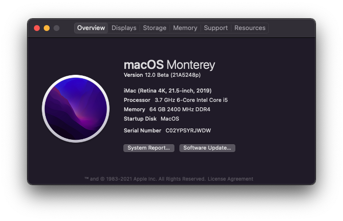

# Gigabyte-Z370-HD3P

Open Core EFI folder for my Hackintosh - macOS Monterey (12)

## Notes

This is still a WIP.

* USB Bluetooth finally works thanks to `BlueToolFixup.kext`
    * Airdrop works
    * Trackpad and BT Mouse works
* CPU information is wrong. The CPU is `Core-i7 8700K`
* USB Mapping needs to change